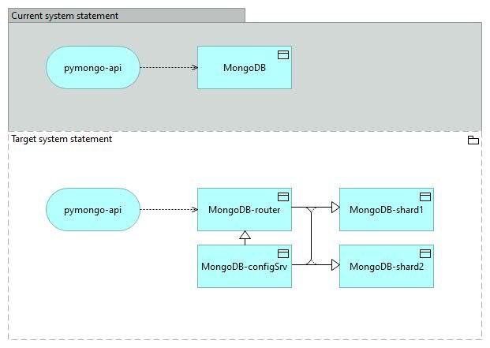

# pymongo-api



## Как запустить

Запускаем mongodb и приложение

```shell
./deploy.sh
```
Ремарка. Файл создан в OS Windows, использует иные символы перехода на новую строку, для иных OS может потребоваться корректировка.

## Как проверить

Для проверки результата введите команды:
```shell
docker exec -it mongo_shard1 mongosh "mongo_shard1:27018/somedb"
db.helloDoc.countDocuments()
exit

docker exec -it mongo_shard2 mongosh "mongo_shard2:27019/somedb"
db.helloDoc.countDocuments()
exit
```