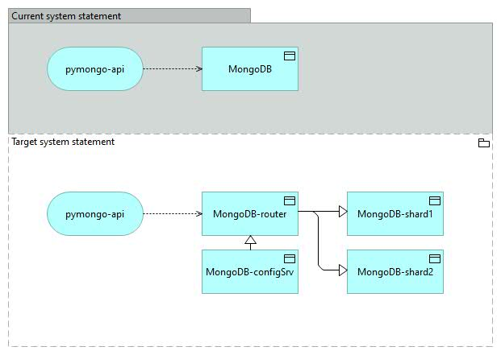

# pymongo-api



## Как запустить

Выполнить команду:
```shell
docker compose up -d --build
```
Инициализация реализована через ентрипоинт дополнительного контейнера. 
Проверять результат можно не ранее чем дополнительный контейнер завершит свою работу.

## Как проверить

Для проверки результата введите команды:
```shell
docker exec -it mongo_shard1 mongosh "mongo_shard1:27018/somedb"
db.helloDoc.countDocuments()
exit

docker exec -it mongo_shard2 mongosh "mongo_shard2:27019/somedb"
db.helloDoc.countDocuments()
exit

```